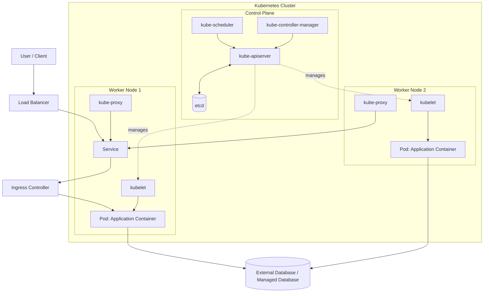

# Kubernetes Architecture

A clear overview of Kubernetes components, how they communicate, and how an application runs inside a cluster.

## 1. Architecture Diagram



> **Note:** This is a conceptual diagram. Ingress controllers, cloud load balancers, and database services are optional and depend on the cluster design. A Service normally routes traffic to matching Pods; an Ingress controller implements HTTP/HTTPS routing rules when Ingress is used.

## 2. What Is Kubernetes?

Kubernetes (K8s) is an open-source container orchestration platform. It helps deploy, scale, and manage containerized applications across a group of machines called a **cluster**.

A Kubernetes cluster is made up of:
- **Control plane** — makes cluster-wide decisions and maintains the desired state.
- **Worker nodes** — run application Pods.

## 3. Control Plane Components

| Component | Responsibility |
|---|---|
| **kube-apiserver** | Entry point for Kubernetes API requests. `kubectl`, controllers, and other components communicate through the API server. |
| **etcd** | Distributed key-value store that holds Kubernetes cluster state and configuration. |
| **kube-scheduler** | Selects a suitable worker node for Pods that have not yet been scheduled. |
| **kube-controller-manager** | Runs controllers that continually compare actual state with desired state and take corrective action. |
| **cloud-controller-manager** *(optional)* | Integrates Kubernetes with a cloud provider for supported services such as load balancers and node lifecycle. |

## 4. Worker Node Components

| Component | Responsibility |
|---|---|
| **kubelet** | Node agent that ensures the Pods assigned to the node are running as specified. |
| **Container runtime** | Runs containers, commonly containerd or another Kubernetes-supported runtime. |
| **kube-proxy** *(common, but not universal)* | Implements Service networking rules on nodes in many cluster configurations. Some networking solutions replace its functionality. |
| **Pods** | Smallest deployable Kubernetes units; each Pod contains one or more closely related containers. |

## 5. Important Kubernetes Objects

- **Pod:** Runs one or more containers.
- **Deployment:** Manages replicated stateless Pods and supports rolling updates and rollbacks.
- **ReplicaSet:** Keeps the requested number of Pod replicas running; usually managed by a Deployment.
- **Service:** Provides a stable virtual endpoint and load-balances traffic to matching Pods.
- **Ingress:** Defines HTTP/HTTPS routing rules; requires an Ingress controller to implement them.
- **ConfigMap:** Stores non-sensitive configuration.
- **Secret:** Stores sensitive configuration data. Configure encryption at rest and access controls as appropriate; a Secret is not automatically secure just because it is a Kubernetes object.
- **PersistentVolume (PV) / PersistentVolumeClaim (PVC):** Represent and request persistent storage.
- **Namespace:** Organizes resources within a cluster.
- **Job / CronJob:** Runs tasks once or on a schedule.

## 6. How an Application Runs

1. A developer builds a container image and pushes it to a container registry.
2. A Deployment manifest is applied using `kubectl`, a CI/CD pipeline, or GitOps tooling.
3. The request reaches the **kube-apiserver**, which validates and records the desired state in `etcd`.
4. The scheduler selects a worker node for each unscheduled Pod.
5. The kubelet on that node asks the container runtime to pull the image and start the containers.
6. Controllers monitor the cluster and reconcile actual state with the desired state.
7. A Service routes traffic to healthy, matching Pods. External traffic may enter through a cloud load balancer and/or an Ingress controller, depending on the setup.
8. If a Pod fails, its controller can create a replacement to maintain the desired replica count.

## 7. Request Flow (Simplified)

```text
Client
  |
  v
Cloud Load Balancer (if configured)
  |
  v
Ingress Controller (if configured)
  |
  v
Service
  |
  +------> Pod replica 1
  |
  +------> Pod replica 2
  |
  +------> Pod replica 3
```

Ingress is not mandatory. For example, a `LoadBalancer` Service can expose an application directly through a cloud load balancer, while a `ClusterIP` Service is reachable only inside the cluster by default.

## 8. High Availability and Scaling

- Run control-plane components across multiple machines for a highly available control plane where supported.
- Use multiple worker nodes and spread replicas across nodes or zones where possible.
- Set resource requests and limits for containers.
- Configure readiness, liveness, and startup probes appropriately.
- Use a Horizontal Pod Autoscaler (HPA) to scale Pod replicas when metrics and workload configuration support it.
- Use PodDisruptionBudgets to help limit voluntary disruptions.
- Back up `etcd` and test cluster recovery procedures.
- Monitor cluster and application health using tools such as Prometheus and Grafana.

## 9. Useful Commands

```bash
# View cluster nodes
kubectl get nodes -o wide

# View namespaces
kubectl get namespaces

# View Pods across all namespaces
kubectl get pods -A -o wide

# View Deployments and Services in the current namespace
kubectl get deployments,services

# Inspect a Pod
kubectl describe pod <pod-name>

# View container logs
kubectl logs <pod-name>

# View recent events
kubectl get events --sort-by=.metadata.creationTimestamp

# View cluster endpoint and configuration
kubectl cluster-info
```

## 10. Summary

The **control plane** manages the cluster and decides what should run. **Worker nodes** run Pods. Kubernetes controllers continually work to bring the actual cluster state in line with the desired state, while Services provide stable networking for application Pods.

---

**Tip:** GitHub renders Mermaid diagrams in Markdown files. If your Markdown viewer does not support Mermaid, use the text-based request-flow diagram in Section 7.
